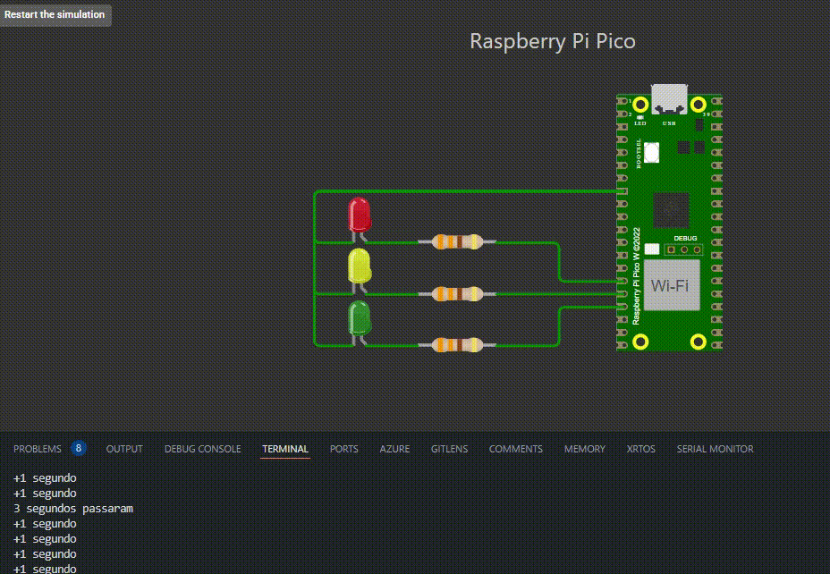

# Projeto: Timer Periódico

## 📝 Descrição do Projeto

Este projeto simula um semáforo utilizando o Raspberry Pi Pico e LEDs. O software gerencia a transição das cores (vermelho, amarelo e verde) em intervalos regulares de 3 segundos.

## 🎯 Características

O programa emprega um temporizador em hardware para alternar os LEDs, reproduzindo o funcionamento de um semáforo:

- LED Vermelho ativado por 3 segundos\

- LED Amarelo ativado por 3 segundos\

- LED Verde ativado por 3 segundos

Os LEDs são manipulados pelos pinos GPIO do Raspberry Pi Pico:

- Pino 11: LED Vermelho\

- Pino 12: LED Amarelo\

- Pino 13: LED Verde

Em cada iteração, a função `repeating_timer_callback` é acionada para modificar o estado dos LEDs.

## 📂 Estrutura do Projeto

O projeto é constituído pelos seguintes arquivos principais:

- `periodic-timer.c`: Contém a lógica principal do sistema.
- `CMakeLists.txt`: Arquivo de configuração do CMake para a geração do binário.

## 🛠️ Requisitos

- Raspberry Pi Pico
- SDK do Pico instalado
- CMake
- Compilador compatível com C e C++

## ⚙️ Compilação e Execução

1. Clone o repositório do projeto:
   ```sh
   git clone https://github.com/thalissoncastrog/embedded-system-periodic-timer.git
   cd embedded-system-periodic-timer
   ```
2. Crie um diretório para a compilação e acesse-o:
   ```sh
   mkdir build
   cd build
   ```
3. Execute o comando CMake para configurar a compilação:
   ```sh
   cmake ..
   ```
4. Compile o projeto:
   ```sh
   make
   ```
5. Transfira o binário gerado para a Raspberry Pi Pico.

## 🎯 Resultado



## 👥 Contribuidores

1. **Adão Thalisson Castro Guimarães** - [GitHub](https://github.com/thalissoncastrog)

## 📜 Licenciamento

Este projeto está sob a Licença MIT. Para mais informações, consulte o arquivo LICENSE.
